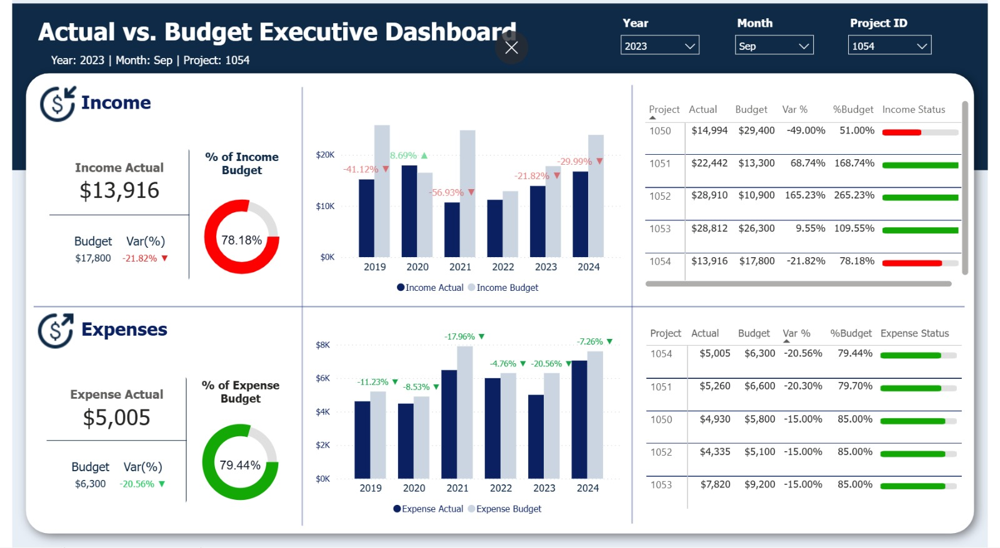
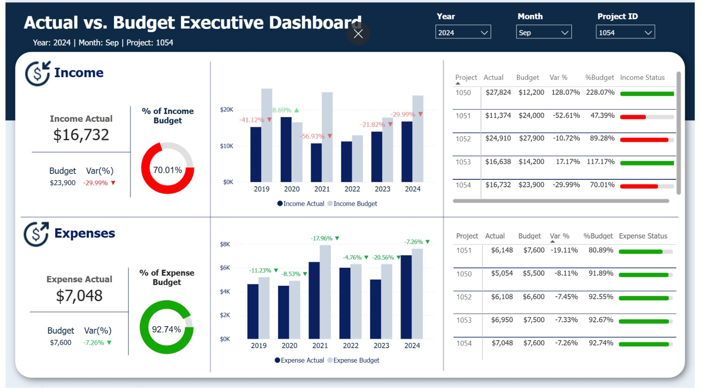

# Budget Monitoring & Variance Analysis – Power BI

This project presents an executive-style Power BI dashboard designed to evaluate **financial performance by comparing actual income and expenses against planned budgets**. Using monthly project-level data from **2019 to 2024**, the dashboard highlights **variance patterns, budget utilization, and long-term trends**, enabling consistent monitoring of financial health across projects and time periods.

The focus of this project is not only to display financial data, but to explain **how performance deviates from expectations, by how much, and why those deviations matter**.

---

## Live Dashboard (Power BI)
View my PowerBI report here: [🔗](https://app.powerbi.com/view?r=eyJrIjoiMzk2YmI5ODEtMzU2Ni00NDg3LTkxMGUtYTMyZWFlMjZkMWNjIiwidCI6ImFlY2ZkNDQ2LThlZGEtNDA1YS1hNzk0LTdkNzk0MGFmMDRkZiJ9)

---

## 📌 Contents

- [Dataset and Financial Context](#dataset-and-financial-context)
- [Financial Concepts and Formulas Applied](#financial-concepts-and-formulas-applied)
  - [Variance](#variance)
  - [Budget Utilization](#budget-utilization)
- [Dashboard Overview](#dashboard-overview)
- [Executive Views and Year Comparison](#executive-views-and-year-comparison)
- [Variance Analysis in Practice (Project 1054)](#variance-analysis-in-practice-project-1054)
- [Why Variance Monitoring Matters](#why-variance-monitoring-matters)
- [Tools Used](#tools-used)
- [Final Note](#final-note)
  
---

## Dataset and Financial Context

The dataset consists of **monthly financial records for multiple projects**, where each record includes both **budgeted** and **actual** values for income and expenses. This structure allows direct comparison between planned targets and realized performance.

Because the data spans several years, it supports:
- Month-level performance tracking  
- Year-over-year comparison for the same project  
- Identification of recurring patterns versus one-time deviations  

This makes the dataset suitable for both short-term monitoring and longer-term financial assessment.

---

## Financial Concepts and Formulas Applied

The dashboard is built around two core financial concepts: **variance** and **budget utilization**. These concepts were chosen because absolute values alone do not adequately explain financial performance.

### Variance

Variance measures the deviation between actual performance and budgeted expectations.

- **Income Variance = Actual Income − Budgeted Income**  
  A negative value indicates revenue underperformance, while a positive value indicates income exceeding expectations.

- **Expense Variance = Budgeted Expense − Actual Expense**  
  A positive value reflects cost savings, whereas a negative value indicates overspending.

To standardize comparisons across projects and time periods, percentage variance is also used:

- **Variance (%) = (Actual − Budget) ÷ Budget**

### Budget Utilization

Budget utilization provides essential context by showing how much of the allocated budget has already been consumed.

- **Budget Utilization (%) = Actual ÷ Budget**

A variance may appear small in isolation, but high budget utilization indicates limited remaining financial flexibility. For this reason, variance and utilization are always interpreted together in the dashboard.

---

## Dashboard Overview

The dashboard is divided into **Income** and **Expense** sections, each designed to evaluate performance from a different financial perspective.

Each section includes:
- Actual vs budget comparison  
- Variance percentage indicators  
- Budget utilization visuals  
- Historical trend charts across multiple years  

Interactive filters allow users to analyze performance by **year, month, and project ID**, supporting both high-level summaries and detailed project-level reviews.

---

## Executive Views and Year Comparison

To assess how performance evolves over time, the dashboard supports direct comparison of the same project and month across different years.

Comparing the same month across years helps isolate performance changes without seasonal effects influencing the analysis.

---

## Variance Analysis in Practice (Project 1054)

A focused comparison was conducted for **Project 1054** for the month of **September**, comparing **2023 and 2024**.

In September 2023, the project generated **$13,916** in actual income against a budget of **$17,800**, resulting in a budget utilization of **78.18%**. This corresponds to an income shortfall of **$3,884**, or approximately **21.8% below budget**.

In September 2024, actual income increased to **$16,732**, but the budget rose more sharply to **$23,900**. Budget utilization declined to **70.01%**, and the income shortfall widened to **$7,168**, nearly **30% below budget**. Despite higher absolute income, performance moved further away from planned expectations.

Expense behavior showed a stronger shift. In September 2023, actual expenses were **$5,005** on a budget of **$6,300**, corresponding to **79.44% budget utilization**. In September 2024, expenses increased to **$7,048** against a budget of **$7,600**, pushing utilization to **92.74%**. This represents an increase of over **13 percentage points** in expense utilization year over year.

Taken together:
- Income increased by roughly **20%**  
- Expenses increased by more than **40%**  
- The gap between revenue and costs narrowed  

This indicates a **compression of the financial margin**, where rising costs offset income growth and increase financial risk.

---

## Why Variance Monitoring Matters

This example illustrates how variance monitoring acts as an early warning mechanism. Rising expenses combined with widening income shortfalls can quickly erode financial buffers if left unaddressed.

By continuously tracking variance and budget utilization across projects and periods, the dashboard helps identify when corrective actions such as cost reviews or budget revisions may be required.

---

## Tools Used

- Power BI  
- DAX for variance and utilization calculations  
- Excel as the data source  

---

### Final Note

This project is designed to demonstrate a structured approach to financial analysis using real, comparable data. Each metric and visual has been intentionally selected to support clear evaluation of income performance, expense behavior, and alignment with budget expectations across projects and time periods. The emphasis is on translating numerical differences into meaningful insights that support monitoring, comparison, and more informed financial planning decisions rather than simply presenting aggregated figures.
